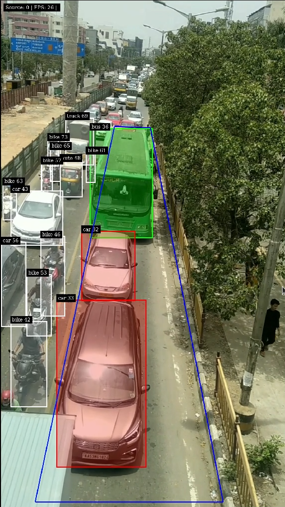
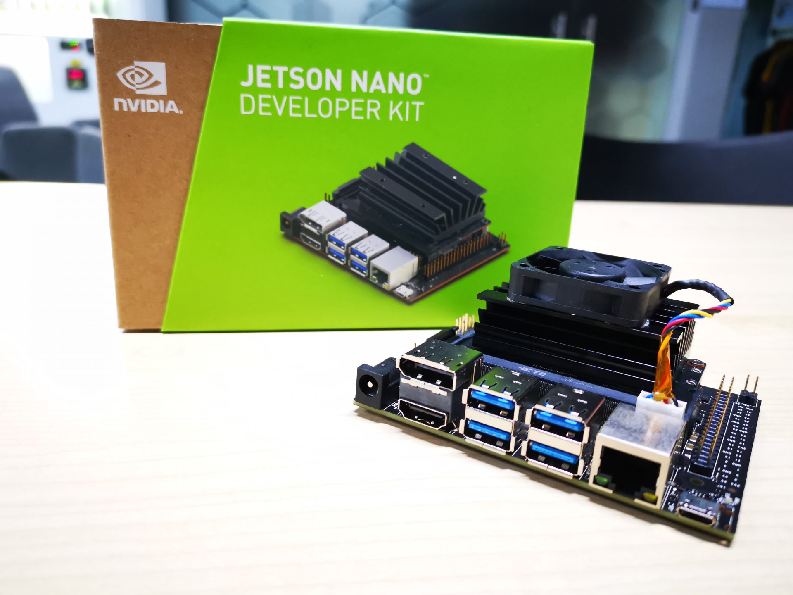

# bus-lane-detection [here](https://youtu.be/9zxcl0a7zjs)

Bus lanes give priority to buses, cutting down on journey times where roads are congested with other traffic and increasing the reliability of buses. But often, we see unauthorised vehicles utilizing these lanes, as a way to bypass traffic. This project demonstrates that we can use Deepstream and Computer Vision to detect such vehicles in a Video analytics pipeline.




## Deepstream Setup




This post assumes you have a fully functional Jetson device. If not, you can refer the documentation [here](https://docs.nvidia.com/jetson/jetpack/install-jetpack/index.html).

### 1. Install System Dependencies

```sh
sudo apt install \
libssl1.0.0 \
libgstreamer1.0-0 \
gstreamer1.0-tools \
gstreamer1.0-plugins-good \
gstreamer1.0-plugins-bad \
gstreamer1.0-plugins-ugly \
gstreamer1.0-libav \
libgstrtspserver-1.0-0 \
libjansson4=2.11-1
uuid \
uuid-dev
```

### 2. Install Deepstream on Dgpu's

Download the DeepStream 5.1 Debian package `deepstream-5.1_5.1.0-1_amd64.deb`, to the DGPU device from [here](https://developer.nvidia.com/deepstream-sdk-download-tesla-archived). Then enter the command:

```sh
sudo apt-get install ./deepstream-5.1_5.1.0-1_amd64.deb
```

### 3. Install Deepstream in Jetson Devices

Download the deb file under - DeepStream 5.1 for Jetson from [here](https://developer.nvidia.com/embedded/deepstream-on-jetson-downloads-archived).

```sh
sudo apt-get install ./deepstream-5.1_5.1.0-1_amd64.deb
```

## Run the Application

### 1. Clone the repository

First, install git and git-lfs

```sh
sudo apt install git git-lfs
```

Next, clone the repository

```sh
# Using HTTPS
git clone https://github.com/ritikgupta-iw/bus-lane-detection.git
# Using SSH
git clone git@github.com:ritikgupta-iw/bus-lane-detection.git
```

Now, enable lfs and pull the Yolov5 weights file

```sh
git lfs install
git lfs pull
```

### 2. Run with different input sources

The computer vision part of the solution can be run on one or many input sources of multiple types, all powered using NVIDIA Deepstream.

Firstly, we must build the application by running the following command:

```sh
make clean && make -j$(nproc)
```

This will generate the binary called `bus-lane`. This is a one-time step and you need to do this only when you make source-code changes.

Next, create a file called `inputsources.txt` and paste the path of videos or rtsp url of CCTV IP cameras.

```sh
file:///home/ritik/Documents/Nvidia-Certificate/Final/bus-lane-detection/video/final.mp4
```

Now, run the application by running the following command:

```sh
./bus-lane
```

Please Find The Demo Video Link [here](https://youtu.be/9zxcl0a7zjs)
